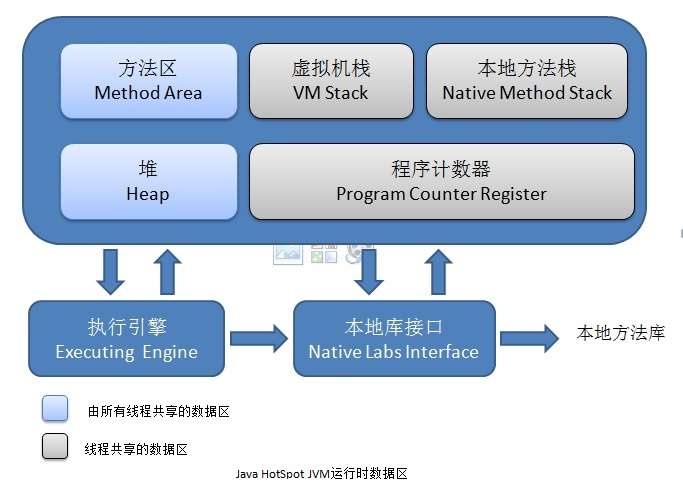

java内存管理和GC
============================

* 关键词：
	* 内存动态分配
	* 垃圾收集

##1 内存区域和OutOfMemoryError

* 简介：
	* java代码执行时，虚拟机会把内存划分为N个数据区域，用途各不同
	* 有生命周期
	

上图里标注的第二个线程共享，其实是线程隔离

###内存区域划分及其生命周期

* 程序计数器：
	* 线程私有：每个线程都有一份，保证线程切换时能恢复现场
	* 空间较小的一块内存空间
	* 指示器，值是当前线程所执行的字节码的行号
	* 字节码解释器通过这个值来选取下一条需要执行的字节码指令
	* 处理分支，循环，跳转，异常，线程恢复
	* 对于java代码，计数器记录的就是正在执行的虚拟机字节码指令地址
	* 对于Native方法，这个计数器值为Undefined
	* 溢出相关：没有OutOfMemoryError的情况

	
* 虚拟机栈：VM Stack
	* 线程私有：其实就是常说的java内存的堆和栈的栈，更确切的说，其实是栈里每个栈帧的局部变量表
	* 生命周期和线程相同
	* 栈里放的是栈帧，Stack Frame，每个方法对应一个栈帧，所以这里还涉及到StackOverflowError，看测试数据，能开2000多个栈帧呢
	* 栈帧存的是：
		* 局部变量表
			* 放各种基本类型（boolean, byte, char, short, int, float, long, double)，和对象引用
			* long和double是64位，占据两个Slot，Slot称为局部变量空间
			* 对象的引用到底是什么，各个虚拟机是不同的：	
				* 可能直接指向堆中的对象
				* 也可能是个句柄，指向堆中的句柄区，而句柄区中的值，才指向真正的对象，多一次寻址，但对象引用可以保持不变
				* 也可能是returnAddress类型：指向一条字节码指令的地址
			* 大小在编译期间决定，运行时不可更改
		* 操作栈
		* 动态链接
		* 方法出口等
	* 栈帧的入栈和出栈，就对应一个方法被调用和返回
	* 异常：会抛出StackOverflow和OutOfMemoryError

* 本地方法栈
	* 功能类似虚拟机栈，只不过是给Native方法用，甚至有的虚拟机实现是将这两个合二为一

* 堆：Heap
	* 最大的一块内存区域，唯一的目的就是存放对象
	* 线程共享
	* 本来规定所有对象实例以及数组都要在堆上分配，但随着JIT编译器的发展和逃逸技术的成熟，栈上分配，标量替换优化技术会导致一些微妙的变化，不那么绝对了
	* 因为这里是GC的主要区域，所以也称GC堆，Garbage Collected Heap
	* 由于垃圾收集器的分代收集算法，这里还分为：
		* 新生代
		* 老年代
	* 分的更细一点
		* Eden空间
		* From Survivor空间
		* To Survivor空间
	* 相关命令行参数：-Xms20m -Xmx20m -XX:+HeapDumpOnOutOfMemoryError
		* Xms20m：堆的最小值，20M
		* Xmx20m：堆的最大值，20M
		* -XX:+HeapDumpOnOutOfMemoryError：出现内存溢出时，Dump除当前内存堆转储快照
	* OOM测试：HeapOOM
		* 需要在命令行启动，参数：-Xms20m -Xmx20m -XX:+HeapDumpOnOutOfMemoryError
		
		

* 方法区：Method Area
	* 存类信息，常量，静态变量，JIT编译后的代码等，又叫Non-Heap（非堆）
	* 线程共享
	* 有时被称为永久代（permanent generation)--最好别这么叫，因为HotSpot虚拟机选择把GC分代收集扩展到方法区
		* 所以就使用了永久代来实现方法区
	* 此区域的垃圾回收主要针对：常量池回收（如不用的字符串常量），类型卸载（不用的class）
		* 类型卸载条件比较苛刻，基本上成绩比较难令人满意
	* 异常：也会抛出OutOfMemoryError
	* 运行时常量池：Runtime Constant Pool
		* 在class文件中存的常量池（Constant Pool Table）中的信息，存的是编译器生成的各种字面量和符号引用，会被加载到运行时常量池
		* 这里其实是动态的，除了编译器放入的常量和直接引用，运行期如String.intern()方法，也会往这里放东西

		
* 直接内存
	* nio中的Channel和Buffer，使用Native函数库直接分配堆外内存
	* 这部分堆外内存，通过java堆里的DirectByteBuffer对象作为这块内存的引用	
		* 说是这样可以避免在java堆和Native堆中来回复制数据，性能显著提高	
	* 涉及到Unsafe类，可以分配直接内存：unsafe.allocateMemory()

		
* OOM提示：
	* 注意，-XX:+HeapDumpOnOutOfMemoryError可以到处内存快照，但这文件一般挺大
	* 堆内存：`Java heap space`
	* 虚拟机栈：无限递归时，会StackOverflow，这也是内存不足的一个反应
	* 本地方法栈：`unable to create new native thread`
	* 方法区：
		* 运行时常量池溢出：会提示`PermGen Space`的OOM
			* 使用到的参数-XX:PermSize和-XX:MaxPermSize限制方法区大小
			* 测试方法是用String.intern()方法动态的往常量池里写入新常量 
		* 方法区Class溢出：类型太多，也是`PermGen Space`
			* 测试方法：动态生成类，如CGLib，动态代理
			* JSP或动态产生JSP的应用，OSGi应用，就要注意这个OOM了，因为会动态生成类，或者同一个类被不同的加载器加载（也算是不同的class对象）
	* 直接内存溢出：
		* 测试方法：使用Unsafe类，unsafe.allocateMemory()会分配直接内存
		* 但Unsafe这个类不能直接在API里用
		* 相关参数：-XX:MaxDirectMemorySize
		
		
##2 垃圾收集		

###（1）相关基础：
	
####四大类引用

strong：强引用，默认
soft：软引用，缺内存时回收
weak：弱引用，下次GC时回收
PhantomReference：虚引用，对GC没影响，只会在对象被回收时，收到一个系统通知

###（2）回收策略

引用计数法，解决不了对象的互相应用，过时了

根搜索算法，引用树，对象通过GC Roots达不到该对象，则对象将被删除
		
		
###（3）垃圾回收算法

####标记和回收
	finalize方法和对象的自救（只能自救一次）

####标记-清除算法

####复制算法

####标记-整理算法

####分代收集算法
		
	
###（4）垃圾收集器

####Serial

####ParNew

####Parallel Scavenge

####Serial Old

####Parallel Old

####CMS

####G1

##2 内存分配和回收策略

####Eden优先

####老年代，新生代
大对象，长期存活的对象，进入老年代
对象年龄判定
空间分配担保

		
===================