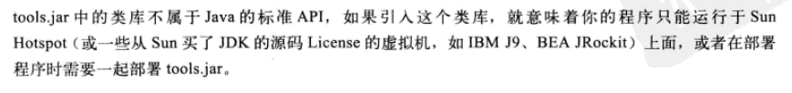

1 netty

2 nio深入

3 并发深入

4 jvm

* tools.jar
    * 默认不引入，引入就说明必须得用sun的HotSpot虚拟机，也可以显式的引入jar包
	* 里面是一些强效的工具，可以监控程序运行
	* 并且大部分功能和jdk的命令行（bin下）工具对应，其实就是对tools.jar的封装
	* 所以这个jar包下的东西还是可以研究研究的
	* 具体参考深入理解JVM的77页
	

5 Classloader

OSGi

6 字节码生成

动态代理

javac命令就是字节码生成技术的老祖宗

CGLib，Javassist，ASM

空过：
JVM第4章：java调优工具，tools.jar包
JVM第5章：几个案例
JVM第10章：编译期优化，早期优化
JVM第11章：运行期优化，晚期优化

JVM 12章：内存模型和线程
JVM 13章：线程安全和锁优化

github自定义页面：项目主页
https://segmentfault.com/a/1190000002765287

=========================================================
博客目录：
1 你想让程序员怎么创建对象

2 怎么定义一个类

equals
hashCode
compare
clone
序列化

方法
异常
通用套路

3 类的交互：设计模式

类和接口
设计模式

4 集合

5 并发

6 io

7 http

8 泛型，枚举，注解

9 classloader

9 gc和缓存

10 惯用套路

